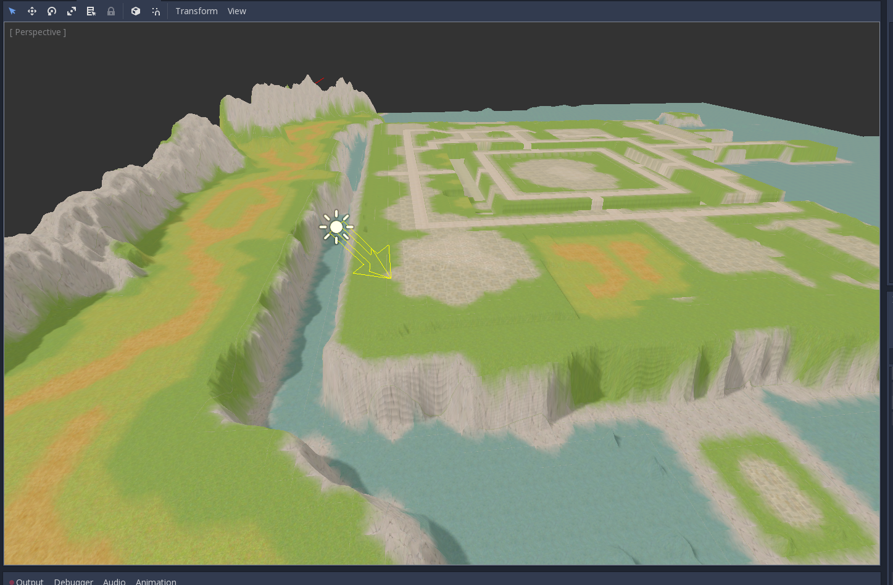
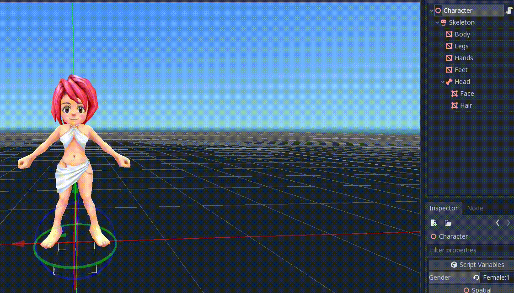

## Client
A ROSE Online client project the Godot Engine. 

### Status
The goal was to create a fully functional client that supports the original ROSE asset types out of
the box with custom importers. Unfortunately after a few months of working with the Godot engine I
found it was not a good fit for this project (godot ~v3.0.1). I included some assets and scenes for
demonstration purpose.

### Features
- Import ROSE meshes/skeletons/animations into the engine directly from ROSE data files.
- Basic 3rd person camera controller
- Basic movement with collision and animation
- Terrain importing w/ textures

### Setup
- Download/build godot for your platform
- Clone or download the `client/` directory

To use the original rose assets just copy them into a directory in `client/`. The importers will
automatically import any data types it recognizes (warning: might take a while and can lock up godot
until it's done).

#### Import Notes:
- **ZMO**: Currently it is not possible to import a ZMO without specifying a
ZMD file for it. To import a ZMO, click the file inside of godot, navigate to
import pane and select the ZMD. You can now re-import the ZMO as expected.
- **DDS**: The DDS files used in the original ROSE Client generally have issues
such as broken mipmaps.  It's recommended to convert them all to PNG and then 
let the engine handle the conversion for exported games. Some of the importing
code will look for PNGs when importing data (e.g. ZMS). Example: 
`fd -e DDS -exec convert {} {.}.png`

